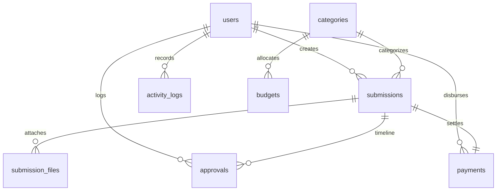

# Sistem Pengajuan Transaksi Pengeluaran (Expense Workflow System)

A secure, enterprise-grade Laravel 12 application built as a technical assessment for managing transaction expense submissions and approval workflows. Designed using the **Repository + Service Pattern**, following **SOLID principles**, and implementing strict **RBAC** using Spatie Permission.

---

## Technical Stack
- **Framework**: Laravel 12
- **PHP Version**: PHP 8.3+
- **Database**: MySQL (Fully normalized to 3NF)
- **Role-Based Access Control**: Spatie Laravel Permission (granular permissions)
- **Frontend**: Bootstrap 5 + HSL Slate Theme + Chart.js + SweetAlert2 + Dark Mode
- **Exports**: DomPDF (PDF reports) & Semicolon-Separated CSV (Excel-compatible streams)
- **API Guard**: Laravel Sanctum

---

## Core Features
1. **Granular RBAC**: 5 default roles (Staff, Supervisor, Manager, Director, Finance) mapped to specific granular permissions.
2. **Dynamic Workflow Engine**: Expense requests route automatically based on Category and Amount thresholds:
   - **PO Produk**: Staff → Director → Finance.
   - **Non-PO <= 5.000.000**: Staff → Supervisor → Finance.
   - **Non-PO > 5.000.000 & <= 10.000.000**: Staff → Supervisor → Manager → Finance.
   - **Non-PO > 10.000.000**: Staff → Supervisor → Manager → Director → Finance.
3. **Pessimistic Locking Budget Checks**: Budget limits are locked and validated in a DB transaction at payment validation time. If category budget is insufficient, the system transitions the status to **Rejected** (Business Rule 5 & 8).
4. **Secure Supporting Documents Upload**: Prevents executable script uploads (sh, php, exe, cgi, bat, py, js) and stores files securely inside private storage (preventing direct web URL leaks).
5. **Interactive UI**: Responsive navbar/sidebar, SweetAlert2 confirmation dialogs, toast notifications, persistent Dark Mode setting, and dynamic Chart.js reporting.
6. **Programmatic REST API**: Fully guarded by Sanctum tokens for remote submissions and budget monitoring.

---

## Database ERD & Relationships (3NF)

Our database is designed in **3rd Normal Form (3NF)** with strict foreign keys, cascade delete constraints where logical, and unique keys:



### Table Definitions & Relations
1. **users**: Primary user accounts.
2. **categories**: Expense categories (e.g. `PO Produk`, `Operasional Kantor`, etc.).
3. **budgets**: Allocated limits per category per fiscal year. Unique composite index on `(category_id, fiscal_year)`.
4. **submissions**: Holds request records, amounts, description, and status. Refers to `users` and `categories` (onDelete: `restrict` to prevent losing historical request data).
5. **submission_files**: Upload paths, file types, and size. Refers to `submissions` (onDelete: `cascade`).
6. **approvals**: History trails of approvals. Refers to `submissions` (onDelete: `cascade`) and `users` (onDelete: `restrict`).
7. **payments**: Settlement reference bank numbers and dates. Refers to `submissions` (onDelete: `cascade`) and `users` (onDelete: `restrict`).
8. **activity_logs**: Records actions, IP addresses, and User Agents for audit logs.

---

## Installation & Setup

Follow these steps to run the application locally:

### 1. Prerequisites
Ensure you have PHP 8.3+, Composer, and MySQL installed on your system.

### 2. Clone and Install Dependencies
```bash
composer install
npm install
```

### 3. Environment Configuration
Copy the `.env.example` file to `.env` and configure your database parameters:
```env
DB_CONNECTION=mysql
DB_HOST=127.0.0.1
DB_PORT=3306
DB_DATABASE=sistem_pengajuan_transaksi
DB_USERNAME=root
DB_PASSWORD=
```

### 4. Generate Application Key & Link Storage
```bash
php artisan key:generate
php artisan storage:link
```

### 5. Run Migrations & Seed Database
Reset all tables and run seeders to instantiate system roles, permissions, categories, budgets, and default accounts:
```bash
php artisan migrate:fresh --seed
```

### 6. Start Development Server
```bash
# In Terminal 1 (Vite compiler)
npm run dev

# In Terminal 2 (Local Server)
php artisan serve
```

---

## Default Accounts (Password: `password`)

Login using the credentials below to test each workflow role:

| Name | Role | Email | Permissions |
| :--- | :--- | :--- | :--- |
| **Budi Staff** | Staff | `staff@system.com` | Create, Read, Update, Delete submissions |
| **Siti Supervisor** | Supervisor | `spv@system.com` | Read submissions, Approve Supervisor stage |
| **Agus Manager** | Manager | `manager@system.com` | Read submissions, Approve Manager stage, View reports |
| **Dewi Director** | Director | `director@system.com` | Read submissions, Approve Director stage, View reports |
| **Fahmi Finance** | Finance | `finance@system.com` | Read submissions, Process payments, Manage budgets/categories/users, View reports |

---

## API Documentation

All API requests (except `/api/login`) require the `Authorization: Bearer <token>` header.

### 1. Authenticate (Get Token)
- **Endpoint**: `POST /api/login`
- **Body (JSON)**:
  ```json
  {
    "email": "staff@system.com",
    "password": "password"
  }
  ```
- **Response**: Returns token string and user role information.

### 2. Submissions API
- **List Submissions**: `GET /api/submissions` (accepts query filters: `search`, `status`, `category_id`)
- **Store Submission**: `POST /api/submissions` (JSON fields: `category_id`, `requested_amount`, `description`)
- **Show Submission**: `GET /api/submissions/{id}`
- **Update Submission**: `PUT /api/submissions/{id}` (Draft only)
- **Delete Submission**: `DELETE /api/submissions/{id}` (Draft only)
- **Submit Submission**: `POST /api/submissions/{id}/submit` (Initiates workflow)

### 3. Budgets API
- **List Budgets**: `GET /api/budgets`
- **Show Budget**: `GET /api/budgets/{categoryId}/{year}`

---

## Verification & Testing
Execute the PHPUnit test suite covering CRUD validations, amount threshold workflows, and transactional budget deductions:
```bash
php artisan test
```
